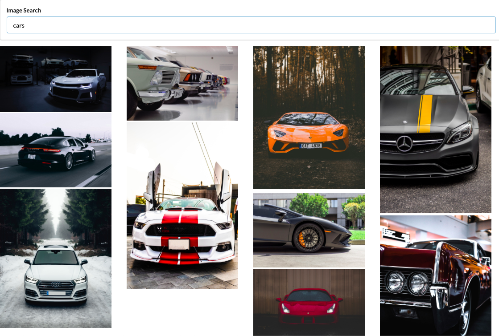
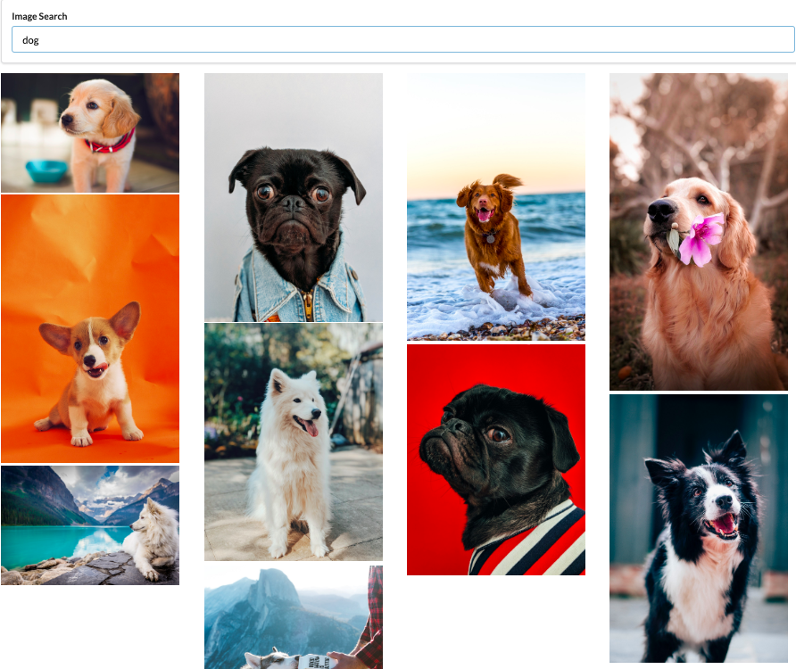
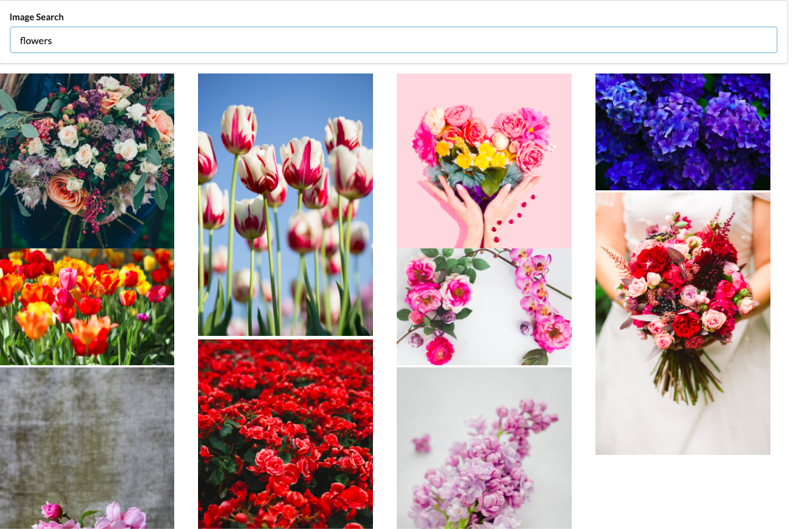

Practice with async calls and axios/fetch  

Fetched data and displayed the data with an asynchronous call based on user input and placed said images into a gridview  
  

Example with cars
  
  

Example with dogs

  
  
Example with flowers
